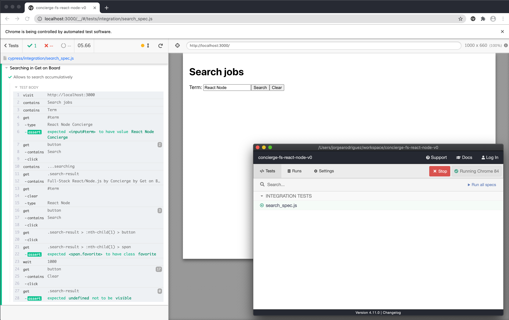
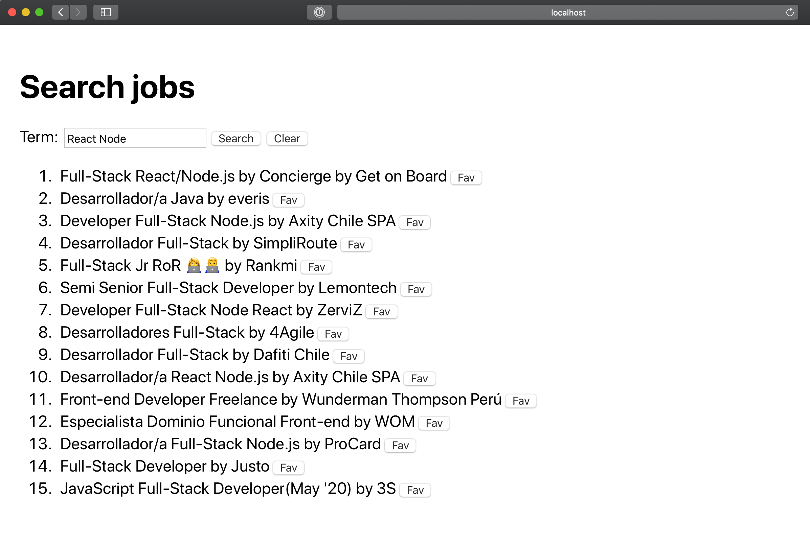

# React and Node challenge

Challenge to assess your skills in React and Node.js

## 🦠 The story

We were building an application in React with a backend in Node.js to do accumulative searches that also allow us to mark some of the jobs as favorites.

It was working great. As you can see in the video below, cypress was all green, and our CEO was happy. Then, we went to eat something only to discover later that COVID deleted part of our code, or at least that is what we want to believe happened 🙈.

Click on the image to open the video:

[](https://drive.google.com/file/d/1-LACFeBM_HcGb_9uCGig5a-m7j1Xdi33/view?usp=sharing)

The thing is, that now our cypress is just errors and we don't have time to re-write everything cause our CEO only gave us **4 hours to finish it**. So, we would love you to help us 🙏.

Did you nod? I knew it, you are aweeesome. Ok, next, some tips:

### Search API specification

The team created a special API to allow other applications searcing jobs in Get on Board. The result is pretty similar to what you get by using the search input text next to the logo when visiting getonbrd.com but in a computer friendly format. This is what you must know about this endpoint.

#### GET /search/jobs

- `URL`: https://www.getonbrd.com/search/jobs
- `Content-Type`: application/json

It returns a list of jobs in JSON (structure specified below). [Click here](https://www.getonbrd.com/search/jobs?q=React+Node+Concierge) if you want to give it a try.

##### Params

- `q` (string)

##### Response

```json
{
  "jobs": [
    {
      "id": "sr-full-stack-react-node-js-get-on-board-remote",
      "title": "Full-Stack React/Node.js",
      "recommended": true,
      "pinned": true,
      "is_hot": false,
      "salary": "3400 - 3800",
      "description": "<p><strong>Hard skills</strong></p><ul><li>...",
      "functions": "<ul><li> Build epic features that go ...",
      "benefits": "<ul><li><strong>You will be screened...",
      "remote": true,
      "city": null,
      "country": null,
      "country_flag_url": null,
      "new": true,
      "seniority": "Senior",
      "logo_url": "https://getonbrd-prod.s3.amazonaws.com/uploads/users/logo/8044/ISO_NEGATIVE-padding-concierge.png",
      "url": "/jobs/programming/sr-full-stack-react-node-js-get-on-board-remote",
      "modality": "Full time",
      "published_at": "Jul 22",
      "company": {
        "name": "Concierge by Get on Board",
        "about": "Concierge is Get on Board's personalized recruiting service. Get screened by us and access exclusive remote jobs, faster.",
        "url": "/companies/concierge-by-get-on-board"
      }
    }
  ]
}
```

## 🤷‍♂️ Missing parts

In order to recover all the work we lost, you need to write some components at the server side and some components at the client side.

Click on the image to open the video and see all we accomplished previous to discover our code was infested with COVID:

[](https://drive.google.com/file/d/1-JGWRiFl5xspJTJ5gN9y8aPG9UUtnRhd/view?usp=sharing)

## 👩‍💻 To run the environment

You are a badass in Node and React so we assume you have your dev enviroment set. The only things you have to do in order to run this app is:

```shell
$ yarn
$ yarn dev
```

## 🦶 Steps

- Fork this repo into a private repository
- Run cypress and see how it fails miserably 💔
- Complete the code
- Run cypress and see how it passes 💚
- Push your repo and invite us to asess how crack you are at coding

Remember: You have **4 hours** to complete the missing parts and make this work, No more time, just **4 hours**.

## 📃 Disclaimer

This is an exercise without any commercial purpose and Get on Board will never by any means:

- Share or use your code
- Oblige you to take this exercise
- Compensate you in any form for taking this exercise

Have fun 🥳 and stay home 🏠.
